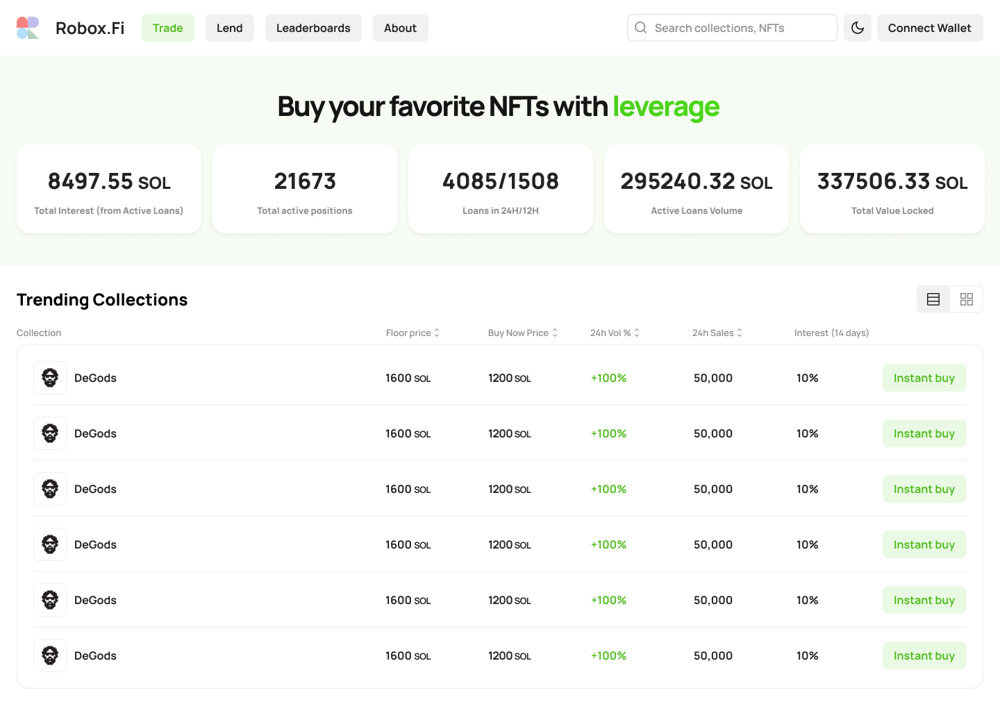

Page design: https://www.figma.com/file/uSgHnDiKb0e3ZJsxatbiSB/Robox-Test?node-id=1-796&t=QvRzAqT9tocFI7TC-0

## Getting Started

First, install all dependencies npm i.

Then:

```bash
npm run dev
# or
yarn dev
# or
pnpm dev
```

Open [http://localhost:3000](http://localhost:3000) with your browser to see the result.


